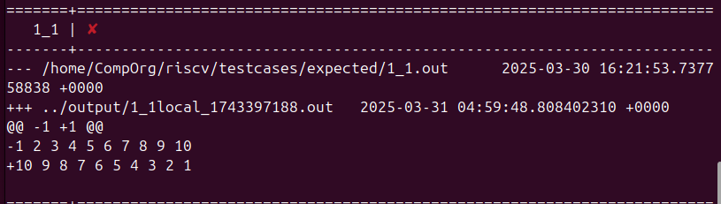

# 開發日記：RISC-V 內嵌組合語言Array Bubble Sort

## 1. 簡介
本作業實作了一個 **使用 RISC-V 內嵌組合語言 (`inline assembly`)** 來執行氣泡排序 (Bubble Sort) 的 C 程式，在 **RISC-V 架構** 下操作記憶體、處理數據，並進行基本的排序運算。

---

## 2. 開發流程

### 2.1 讀取輸入數據
1. 透過 `fscanf()` 讀取輸入檔案的 **數據長度 (`arr_size`)**。
2. 建立長度為 `arr_size` 的 **整數陣列 (`arr[]`)**。
3. 迴圈讀取 `arr_size` 個數字，並存入 `arr[]`。

#### **程式碼段：**
```c
fscanf(input, "%d", &arr_size);
int arr[arr_size];
for (int i = 0; i < arr_size; i++) {
    fscanf(input, "%d", &arr[i]);
}
```

---

### 2.2 Bubble Sort
氣泡排序透過兩層迴圈來進行數據比較與交換。

1. **內嵌組合語言**
   - **載入數據 (`lw`)**：將 `arr[j]` 和 `arr[j+1]` 分別載入 `t0` 和 `t1`。
   - **比較 (`bge`)**：若 `arr[j] >= arr[j+1]`，則跳過交換。(錯誤)
    <mark> 應該是前一項小於等於跳過交換</mark>。
   - **交換 (`sw`)**：若 `arr[j] < arr[j+1]`，則交換兩數的位置。

#### **程式碼段 (RISC-V 組合語言)**
```c
asm volatile (
    "lw t0, 0(%0)\n"        // 載入 arr[j] 到 t0
    "lw t1, 0(%1)\n"        // 載入 arr[j+1] 到 t1
    "bge t0, t1, 1f\n"    //若 arr[j] >= arr[j+1]，跳過交換 
    "sw t1, 0(%0)\n"        // arr[j] = arr[j+1]
    "sw t0, 0(%1)\n"        // arr[j+1] = arr[j]
    "1:"
    :
    : "r"(p_a + j), "r"(p_a + j + 1)
    : "t0", "t1", "memory"
);
```


---


> **圖 1**: (錯誤)排列順序倒反 

**Debug**： 將` "bge t0, t1, 1f\n" `改為 `"ble t0, t1, 1f\n"`


### 2.3 輸出排序結果
1. **重設指標** `p_a = &arr[0]`。
2. **逐個印出** 排序後的 `arr[]` 數據。

#### **程式碼段：**
```c
p_a = &arr[0];
for (int i = 0; i < arr_size; i++)
    printf("%d ", *p_a++);
printf("\n");
```

---

# 開發日記：RISC-V 內嵌組合語言Array Search

